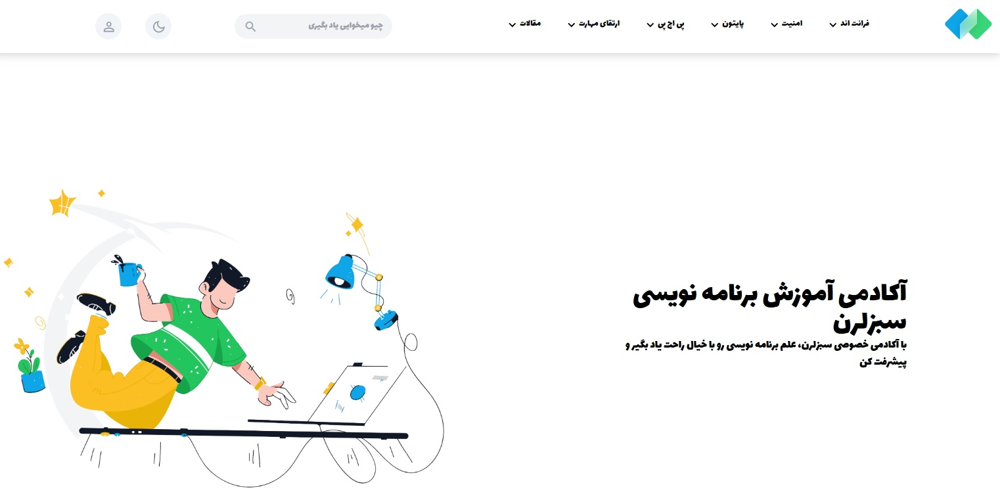
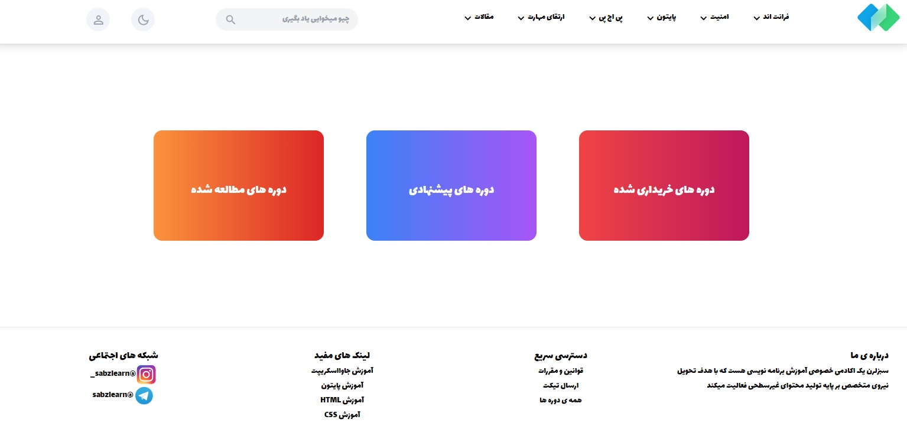

# Static Practice Website

#

#

#

This is a static practice website modeled after the SabzLearn website. As a result, all links related to its courses and lessons are inactive.
Overview

This project serves as a practice exercise to mimic the layout and design of the SabzLearn website. The main objective is to develop and refine skills in front-end web development using modern technologies and best practices.
Features

    Static Website: This project is purely front-end and does not include any server-side functionality.
    Modeled After SabzLearn: The design and layout are inspired by the SabzLearn website to provide a realistic and challenging practice environment.
    Inactive Links: All links related to courses and lessons are intentionally disabled.
## vercel
vercel link: https://vercel.com/amir-shariats-projects-d1218d86/sablearn

Technologies Used

    HTML
    CSS
    JavaScript
    React (if applicable)
    Tailwind CSS (if applicable)
    Other relevant front-end libraries and tools
